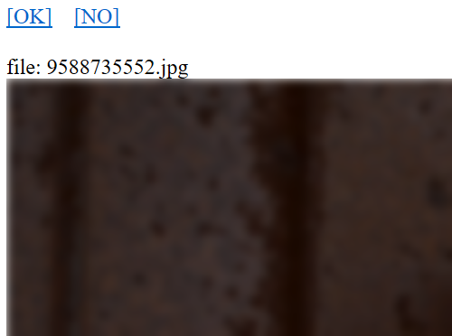

# Manual image classification for ai

====

Manually enter the correctness of the jpeg or png or gif image and copy the reduced image to each folder.  
 (Use for supervised learning of image correctness to AI)  

## Demo

Specify the correctness of the image one after another by [OK] or [NO].

## Requirement

* php7
* Webserver (ex.Apache)

## Usage

Run from the web server.

## Install

1. Set original images to './images/'.
1. Upload to the web server.
1. Change folder write attributes to './yes' and './no'.

## Licence

[MIT](https://github.com/hiroshikuze/manual-image-classification-for-ai/blob/master/LICENSE)

## Author

[hiroshikuze](https://github.com/hiroshikuze/)